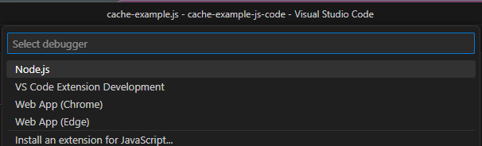

Here are the steps to create a new Node.js project that uses the cache helpers and includes the test functions:

1. Open a command prompt or terminal.

2. Navigate to the desired directory where you want to create your Node.js project.

3. Run the following command to create a new Node.js project:

   ```
   npm init -y
   ```

   This command initializes a new Node.js project with default settings.

4. Create a new JavaScript file, such as `cache-example.js`, and open it in a code editor.

5. Copy and paste the cache helpers and test functions code into the `cache-example.js` file.

6. Save the `cache-example.js` file.

7. Run the following command to execute the Node.js script:

   ```
   node cache-example.js
   ```

   This command will run the script and display the test results in the console.

8. Checkout the full project here: [Readme.md](./cache-example-js-code/README.md)


To start a debug session in VS Code that runs the `cache-example.js` script with Node.js, you can follow these steps:

1. Open the folder containing your `cache-example.js` file in Visual Studio Code.

2. Click on the Debug icon in the left sidebar or press `Ctrl + Shift + D` to open the Debug view.


3. In the Debug view, appropriate button.  to open the launch configuration dropdown, and select "Node.js".

4. If there's no existing `launch.json` file, VS Code will prompt you to create one. Select "Create a launch.json file". Then select Node.js




5. In the newly created `launch.json` file, you'll see a configuration named "Launch Program". Replace the `"program": "${workspaceFolder}/index.js"` line if needed with `"program": "${workspaceFolder}/cache-example.js"`. My VS Code had it correct.

6. Optionally, you can set breakpoints in your `cache-example.js` file by clicking on the left gutter of the line where you want to pause execution.

7. Now, you can start the debug session by clicking on the green "Start Debugging" button in the Debug view, or by pressing `F5`.

8. VS Code will run the `cache-example.js` script with Node.js and pause at any breakpoints you've set. You can use the debug toolbar at the top to step through your code, inspect variables, and analyze the execution flow.

That's it! You have started a debug session in VS Code that runs the `cache-example.js` script using Node.js.


You now have a Node.js project that uses the cache helpers and includes the test functions. You can further customize the project structure, add more files, or integrate it into your existing project as needed.

```javascript
const _featureFlag_isConsoleLogEnabled = true;

//---------------------------------------------
// LRU CLASS Implementation
//---------------------------------------------

const _resetHoursInterval = 1; // In PROD set it to at least 24 hours
const _resetStatInterval = _resetHoursInterval * 60 * 60 * 1000; // Run every X hours (X hours * 60 minutes * 60 seconds * 1000 milliseconds)
//const _resetStatInterval = 10 * 1000; // For testing, clear every 30 seconds

class MyLRU {
    constructor(capacity) {
      this.cache = new Map();
      this.capacity = capacity;
      this.cacheStats = {
        _setCount: 0,
        _hitCount: 0,
        _missCount: 0,
        _expiredCount: 0,
      };

      // Setup interval to reset cache stats
      setInterval(() => {
        this.logCacheStats();
        this.resetCacheStats();
      }, _resetStatInterval);
    }

    isExpired(date) {
        let currentDate = new Date();
        return date < currentDate;
      }

    get(key) {
      if (!this.cache.has(key)) return '';
  
        let data = this.cache.get(key);
        if (data){
            if (this.isExpired(data.exp))
            {
              this.cacheStats._expiredCount++;

              consolelog(`cache.get - key: ${key}, seconds expired: ${calculateSecondsDifferenceFromDate(data.exp)}, full date expired: ${data.exp}`);

              this.cache.delete(key);
              return '';
            }

            this.cacheStats._hitCount++;
            return data.v;
        }
        else {
            this.cacheStats._missCount++;

            return '';
        }
    }
  
    // Setting value with default expiration of 60 seconds
    set(key, value, expirationInSeconds = 60) {
      this.cache.delete(key);
  
      if (this.cache.size === this.capacity) {
        consolelog('cache.set - Cache reached capacity. Deleting one entry.');

        this.cache.delete(this.cache.keys().next().value);
      } 

      let dtWhenToExpire = addSecondsToCurrentDateTime(expirationInSeconds);

      // Create object with additional info to store
      let o = { 
        v: value,
        exp: dtWhenToExpire
      };

      this.cache.set(key, o);

      consolelog(`cache.set - key: ${key}, expiration: ${dtWhenToExpire}`);
    }

    resetCacheStats() {
      this.cacheStats._setCount = 0;
      this.cacheStats._hitCount = 0;
      this.cacheStats._missCount = 0;
      this.cacheStats._expiredCount = 0;
      
      consolelog(`cache.resetCacheStats`);
    }

    formatCacheStats() {
      return `cache.CacheStats: {_setCount: ${this.cacheStats._setCount}, _hitCount: ${this.cacheStats._hitCount}, _missCount: ${this.cacheStats._missCount}, _expiredCount: ${this.cacheStats._expiredCount}}`;
    }
    
    logCacheStats() {
      consolelog(this.cacheStats);
    }
  }

//----------------------------------
// Utility helpers
//----------------------------------
  
  function consolelog(value) {
    if (value && _featureFlag_isConsoleLogEnabled) {
      console.log(value);
    }
  }
  
  function calculateSecondsDifferenceFromDate(date) {
    const currentDate = new Date();
    const differenceInSeconds = Math.floor((date - currentDate) / 1000);
    return differenceInSeconds;
  }
  
  function addSecondsToCurrentDateTime(seconds) {
    let currentDateTime = new Date();
    let updatedDateTime = new Date(currentDateTime.getTime() + seconds * 1000);
    return updatedDateTime;
  }

// Helper function for caching with default expiration (default expiration is 1 minute)
function cacheWithDefaultExpiration(key, value, expirationInSeconds = 60) {
  cache.set(key, value, expirationInSeconds); // Override expiration to seconds
}

// Additional example helpers in case different category of data requires different expiration duration
// Helper function for caching with expiration of 5 minutes with clear naming
function cacheWithFiveMinuteExpiration(key, value) {
  cache.set(key, value, 5 * 60); // Override expiration to 5 minutes
}

// Helper function for caching with expiration of 30 minutes with clear naming
function cacheWithThirtyMinuteExpiration(key, value) {
  cache.set(key, value, 30 * 60); // Override expiration to 30 minutes
}

// Helper function to retrieve cached values
// expiration is handled by MyLRU and will either return data or an empty string ''
function getCachedValue(key) {
  let value = cache.get(key);
  return value;
}

// Helper function to generate a compound key based on 5 string parameters
function generateCompoundKey(param1 = '', param2 = '', param3 = '', param4 = '', param5 = '') {
  let parameters = [param1 || '', param2 || '', param3 || '', param4 || '', param5 || ''];
  let compoundKey = parameters.join('-');
  return compoundKey;
}

// Helper function to parse a compound key into an object with 5 parameters
function parseCompoundKey(compoundKey) {
  const [param1, param2, param3, param4, param5] = compoundKey.split('-');
  return {
    param1: param1 || '',
    param2: param2 || '',
    param3: param3 || '',
    param4: param4 || '',
    param5: param5 || '',
  };
}

//----------------------------------
// Test helpers
//----------------------------------

// Test helper function to simplify testing cache values
function testCacheValue(key, value, expected) {
  cacheWithDefaultExpiration(key, value);
  const cachedValue = getCachedValue(key);
  console.log(`Key: ${key}`);
  console.log(`Cached Value: ${cachedValue}`);
  console.log(`Expected Value: ${expected}`);
  console.log(`Test Result: ${cachedValue === expected ? 'PASS' : 'FAIL'}`);
  console.log('---');
}

// Test helper function to simplify testing cache values with expiration parameter
function testCacheValueWithExpiration(key, value, expected, expirationInSeconds = 5) {
  cacheWithDefaultExpiration(key, value, expirationInSeconds);
  const cachedValue = getCachedValue(key);
  console.log(`Key: ${key}`);
  console.log(`Cached Value: ${cachedValue}`);
  console.log(`Expected Value: ${expected}`);
  console.log(`Test Result: ${cachedValue === expected ? 'PASS' : 'FAIL'}`);
  console.log('---');
}

// To summarize the `testCacheValueWithExpirationAndWait` function includes the `waitSecondsBeforeGettingValueFromCache` parameter, which specifies the number of seconds to wait before calling `getCachedValue` in the function. 
// Test helper function to simplify testing cache values with expiration and wait time
function testCacheValueWithExpirationAndWait(key, value, expected, expirationInSeconds = 5, waitSecondsBeforeGettingValueFromCache = 0) {
  cacheWithDefaultExpiration(key, value, expirationInSeconds);
  console.log(`Key: ${key}`);
  console.log(`Cached Value: ${getCachedValue(key)}`);
  console.log(`Expected Value: ${expected}`);
  console.log('Waiting for cache expiration...');
  setTimeout(() => {
    console.log('Finished waiting. Getting cached value...');
    const cachedValue = getCachedValue(key);
    console.log(`Cached Value after expiration: ${cachedValue}`);
    console.log(`Test Result: ${cachedValue === expected ? 'PASS' : 'FAIL'}`);
    console.log('---');
  }, waitSecondsBeforeGettingValueFromCache * 1000);
}

///////////////////////////////////////////////////
// START of code execution
///////////////////////////////////////////////////

// Initialize an LRU cache with a maximum size of 10 items (Increase value based on your requirements. 10 is good for testing.)
const cache = new MyLRU(10);


///////////////////////////////////////////////////
// TESTS
///////////////////////////////////////////////////

const compoundKey1 = {
  param1: 'a',
  param2: 'b',
  param3: 'c',
  param4: 'd',
  param5: 'e',
};
const compoundKey2 = {
  param1: '',
  param2: '2',
  param3: '',
  param4: '4',
  param5: '',
};

const COMPOUND_KEY_1 = 'a-b-c-d-e';
const COMPOUND_KEY_2 = '-2--4-';

const generatedCK1 = generateCompoundKey(compoundKey1.param1, compoundKey1.param2, compoundKey1.param3, compoundKey1.param4, compoundKey1.param5 );
console.log(`Test 1 generateCompoundKey: ${COMPOUND_KEY_1 === generatedCK1 ? 'PASS' : 'FAIL'}`);


const generatedCK2 = generateCompoundKey(compoundKey2.param1, compoundKey2.param2, compoundKey2.param3, compoundKey2.param4, compoundKey2.param5 );
console.log(`Test 2 generateCompoundKey: ${COMPOUND_KEY_2 === generatedCK2 ? 'PASS' : 'FAIL'}`);

// Example usages and tests
const TEST_VALUE_1 = 'value1';
const TEST_VALUE_2 = 'value2';
const TEST_VALUE_3 = 'value3';
const TEST_VALUE_4 = 'value4';
const TEST_VALUE_EMPTY = '';

// Test cache value with 5-second expiration
testCacheValueWithExpiration('key1', TEST_VALUE_1, TEST_VALUE_1, 5);

// Test cache value with 10-second expiration
testCacheValueWithExpiration('key2', TEST_VALUE_2, TEST_VALUE_2, 10);

// Test with compound key 'abc-def-null-ghi-jkl'
const params1 = parseCompoundKey(generateCompoundKey('abc', 'def', null, 'ghi', 'jkl'));
testCacheValue(params1.param1, TEST_VALUE_1, TEST_VALUE_1);
testCacheValue(params1.param2, TEST_VALUE_2, TEST_VALUE_2);

// Test with compound key 'xyz-pqr-stu-null-vwx'
const params2 = parseCompoundKey(generateCompoundKey('xyz', 'pqr', 'stu', null, 'vwx'));
testCacheValue(params2.param3, TEST_VALUE_2, TEST_VALUE_2);
testCacheValue(params2.param4, TEST_VALUE_3, TEST_VALUE_3);

// Test with 1st key param 
const params3str = generateCompoundKey('foo', 'bar', 'baz', 'qux', 'quux');
const params3 = parseCompoundKey(params3str);
testCacheValue(params3.param2, TEST_VALUE_3, TEST_VALUE_3);

// Test with compound key 'foo-bar-baz-qux-quux'
testCacheValue(params3str, TEST_VALUE_4, TEST_VALUE_4);

// Test with compound key 'abc-def-null-ghi-jkl'
const params4str = generateCompoundKey('abc', 'def', null, 'ghi', 'jkl');
const params4 = parseCompoundKey(params4str);
testCacheValue(params4.param1, TEST_VALUE_1, TEST_VALUE_1);
testCacheValue(params4.param2, TEST_VALUE_2, TEST_VALUE_2);

// Test with compound key 'xyz-pqr-stu-null-vwx'
const params5str = generateCompoundKey('xyz', 'pqr', 'stu', null, 'vwx');
const params5 = parseCompoundKey(params5str);
testCacheValue(params5.param3, TEST_VALUE_2, TEST_VALUE_2);
testCacheValue(params5str, TEST_VALUE_3, TEST_VALUE_3);

// Test with compound key 'foo-bar-baz-qux-quux'
const params6str = generateCompoundKey('foo', 'bat', 'baz', 'qux', 'yz1');
const params6 = parseCompoundKey(params6str);
testCacheValue(params6.param2, TEST_VALUE_3, TEST_VALUE_3);
testCacheValue(params6str, TEST_VALUE_3, TEST_VALUE_3);

cache.logCacheStats();
//cache.resetCacheStats();
consolelog(cache.formatCacheStats());

// Test cache value with 5-second expiration
testCacheValueWithExpiration('key3', TEST_VALUE_1, TEST_VALUE_1, 5);

// Test cache value with 10-second expiration
testCacheValueWithExpiration('key4', TEST_VALUE_2, TEST_VALUE_2, 10);

// Test cache value that hasn't expired (data will expire in 10 seconds, get will happen in 5 seconds)
testCacheValueWithExpirationAndWait('key6', TEST_VALUE_2, TEST_VALUE_2, 10, 5);

// Test cache value that is expired  (data will expire in 5 seconds, get will happen in 10 seconds)
testCacheValueWithExpirationAndWait('key5', TEST_VALUE_1, TEST_VALUE_EMPTY, 5, 10);


```
   
Some of you may ask why wouldn't we just have a helper that takes an array for strings to create a compound key. And the answer is there isn't a reason not to have that. If you want to keep things flexible and aren't worried that  be certain that the lack of a key param will not overwrite a key that's 

This is a way I would implement a helper function that takes an array of strings and generates a compound key by concatenating them with a dash separator:

```javascript
function generateCompoundKeyFromArray(keyArray) {
  return keyArray.join('-');
}
```

In this example, the `generateCompoundKeyFromArray` function takes an array of strings (`keyArray`) as a parameter. It uses the `join` method to concatenate the strings in the array with a dash separator (`-`).

Here's an example usage of the `generateCompoundKeyFromArray` function:

```javascript
const keyArray = ['abc', 'def', 'ghi', 'jkl'];
const compoundKey = generateCompoundKeyFromArray(keyArray);
console.log(compoundKey); // Output: abc-def-ghi-jkl

// Same result
const samecompoundKey = generateCompoundKey('abc', 'def', 'ghi', 'jkl');

// But if you're always dealing with 5-part key then this wouldn't match having this as an array: ['abc', 'def', 'ghi', 'jkl']
const samecompoundKey = generateCompoundKey('abc', 'def', 'ghi', null, 'mno');
// generates: abc-def-ghi--mno

// This is equivalent
const keyArray = ['abc', 'def', 'ghi', null, 'jkl'];

```


If you require your compount key can consist of 5 sub-keys and position is important than using an array may not be ideal. It'll work if you can guarantee the array is always generated consistently with 5 items. And that get difficult to manage in a large code base with multiple contributors.

To improve passing multiple keys to make a compound key and add some typesafety to it, it's better to create an interface and object with those properties. But now we're switching to TypeScript.

Below is an example of a helper function that takes an object of type `AllKeys` (defined by the interface) and outputs all its properties to the console:

```typescript
interface AllKeys {
  param1: string;
  param2: string;
  param3: string;
  param4: string;
  param5: string;
}

function logObjectProperties(obj: AllKeys) {
  for (const key in obj) {
    if (obj.hasOwnProperty(key)) {
      console.log(`${key}: ${obj[key]}`);
    }
  }
}

const myObject: AllKeys = {
  param1: 'value1',
  param2: 'value2',
  param3: 'value3',
  param4: 'value4',
  param5: 'value5',
};

logObjectProperties(myObject);
```

In this example, the `logObjectProperties` function takes an object of type `MyObject` as a parameter. It uses a `for...in` loop to iterate over each property of the object and logs the property name and value to the console.

The `myObject` variable is an instance of `MyObject` with its properties assigned string values. Calling `logObjectProperties(myObject)` will output all the properties of `myObject` to the console.

You can customize the interface and the properties within the `MyObject` interface to match your specific requirements.